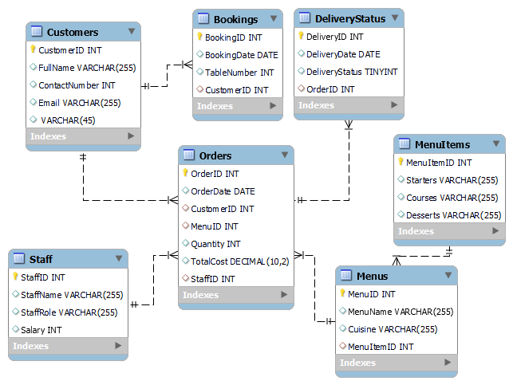

# Project Title: Little Lemon Database
In this project, we used MySQL Workbench for modeling a database for LittleLemon restaurant and deployed the model as MySQL database. We also created several stored procedures for enabling secure CRUD operations using transactions and generating sales reports.

<figure style = "width: 50%;" >

<figcaption>Fig.1 - Database ER Diagram.</figcaption>
</figure>

We then used MySQL Python Connector to create a Python database client and run queries from Jupyter Notebook.
The data from our database was finally analyzed using Tableau to create Visualizations and Dashboards to gain business insights.

## Terminologies

### Stored Procedures:
A stored procedure is a pre-compiled SQL code that can be saved and reused on demand. It is a set of SQL statements that are stored in the database and executed when needed. Stored procedures are beneficial because they reduce network traffic by eliminating the need to send multiple SQL statements over the network. They also improve the security of the database by providing a way to limit direct access to tables.

### Prepared Statements:
Prepared statements are parameterized SQL queries that are compiled and stored in the database. Prepared statements can be used to improve performance by reducing the amount of time spent parsing SQL queries. Prepared statements also help to prevent SQL injection attacks by using placeholders for input variables that are later bound to actual values.

### Transactions:
A transaction is a series of database operations that are executed as a single, indivisible unit of work. Transactions are used to ensure data consistency and integrity, and to provide a way to undo changes made to the database in case of an error. Transactions are typically used when performing complex or critical operations, such as financial transactions.

### Triggers:
A trigger is a database object that is associated with a table and automatically executes a set of SQL statements in response to a specific event, such as an insert, update, or delete operation. Triggers are commonly used to enforce business rules and to maintain referential integrity between related tables. They can also be used to log changes made to the database for auditing purposes. Triggers can be defined to execute before or after the event that triggers them.

## Data Analytics with Tableau
We used Tableau to perform data analytics using relevant charts and dashboards. Here are some visualizations used.

1. Create a bar chart that shows customers' sales and filter data based on sales with at least $70.

<figure style = "width: 50%;" >

<figcaption>Fig.2 - Customers Sales.</figcaption>
</figure>

2. Created a line chart showing the sales trend from 2019 to 2022.

<figure style = "width: 50%;" >

<figcaption>Fig.3 - Profits.</figcaption>
</figure>

3. Created a Bubble chart of sales for all customers.

<figure style = "width: 50%;" >

<figcaption>Fig.4 - Sales Buble Chart.</figcaption>
</figure>

4. Created a Bar chart that shows the sales of the Turkish, Italian, and Greek cuisines for the years 2020 - 2022.

<figure style = "width: 50%;" >

<figcaption>Fig.5 - Sales of the Turkish, Italian, and Greek cuisines.</figcaption>
</figure>

5. Created an interactive dashboard that combines the Bar chart and the Bubble chart.

<figure style = "width: 50%;" >

<figcaption>Fig.6 - Dashboard with the Bar chart and the Bubble chart.</figcaption>
</figure>
